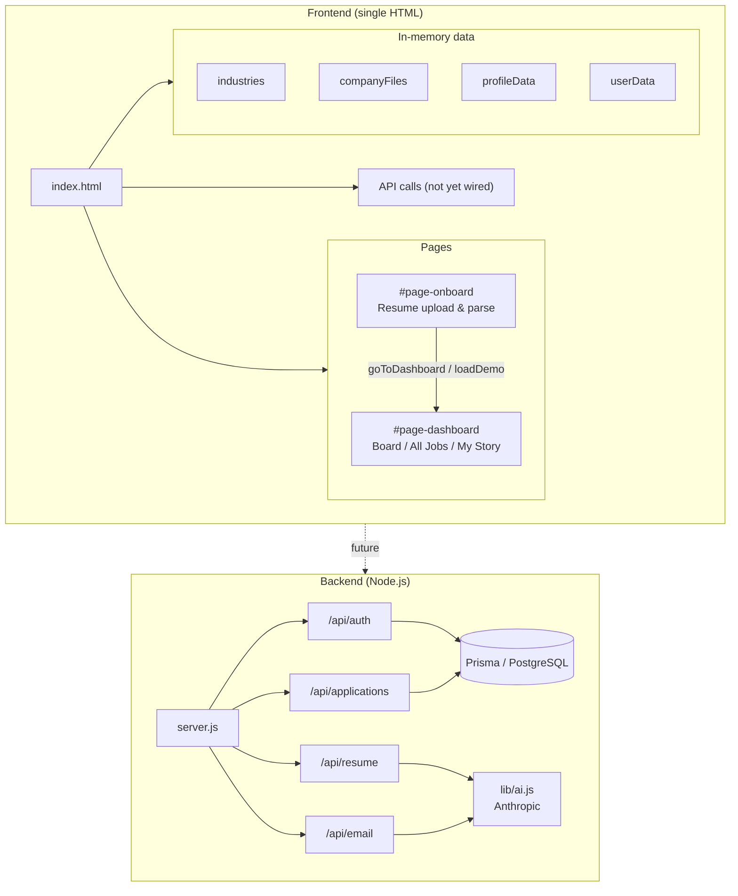
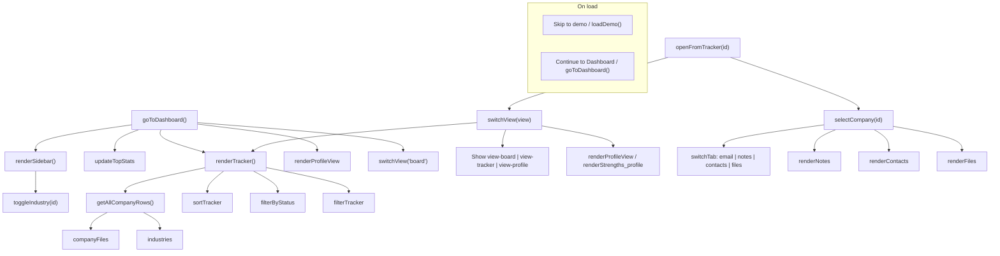
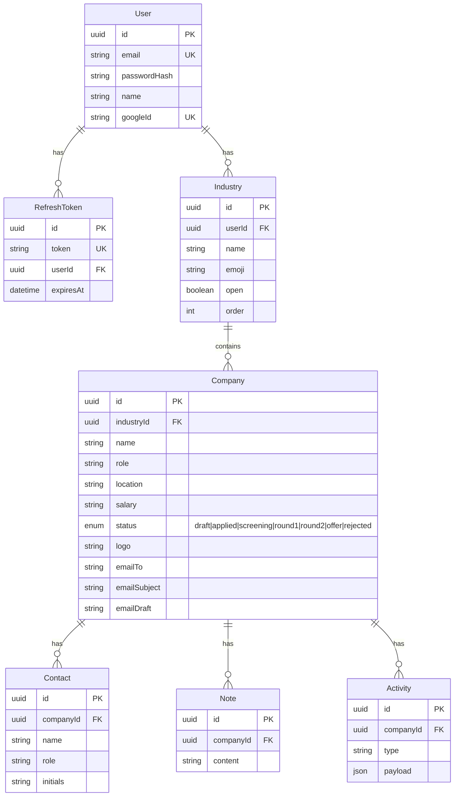

# Candor — Codebase Architecture

## 1. High-level overview



---

## 2. Frontend: pages & views

```mermaid
flowchart LR
  subgraph Onboarding["Onboarding"]
    A["#page-onboard"]
    A --> B[Drop zone]
    A --> C[Parse progress]
    A --> D[Parsed tags]
    A --> E[Continue / Skip demo]
  end

  subgraph Dashboard["Dashboard (#page-dashboard)"]
    Nav[Top nav\nBoard | All Jobs | My Story]
    Nav --> V1
    Nav --> V2
    Nav --> V3

    subgraph V1["#view-board"]
      Sidebar[Sidebar\nIndustry groups\nCompany list]
      Main[Main content]
      Sidebar --> Main
      Main --> Empty[Empty state]
      Main --> Detail[Company detail]
      Detail --> T1[Cover Letter / Email]
      Detail --> T2[Notes]
      Detail --> T3[Contacts]
      Detail --> T4[Files]
    end

    subgraph V2["#view-tracker"]
      Toolbar[Search + status filters]
      Table[Sortable table\nCompany, Role, Industry, Location, Salary, Status, Files, Updated]
      Toolbar --> Table
    end

    subgraph V3["#view-profile"]
      ProfileHdr[Header: name, headline, tags]
      Narrative[AI Narrative]
      Cols[Two columns]
      ProfileHdr --> Narrative
      Narrative --> Cols
      Cols --> Timeline[Career Timeline]
      Cols --> Skills[Skills + AI Strengths + Looking For]
      Obs[AI Observations]
      Cols --> Obs
    end
  end

  E -->|goToDashboard()| Dashboard
```

---

## 3. Frontend: main JS flow



---

## 4. Backend: server & routes

```mermaid
flowchart TB
  Server["server.js\nExpress + CORS + rate limit"]
  Server --> Auth["routes/auth.js"]
  Server --> Applications["routes/applications.js"]
  Server --> Resume["routes/resume.js"]
  Server --> Email["routes/email.js"]

  Auth --> |POST| Register["/register"]
  Auth --> |POST| Login["/login"]
  Auth --> |POST| Google["/google"]
  Auth --> |POST| Refresh["/refresh"]
  Auth --> |POST| Logout["/logout"]
  Auth --> |GET| Me["/me (auth)"]

  Applications --> |GET| GetIndustries["/industries (auth)"]
  Applications --> |POST| PostIndustry["/industries (auth)"]
  Applications --> |PUT| PutIndustry["/industries/:id (auth)"]
  Applications --> |DELETE| DelIndustry["/industries/:id (auth)"]
  Applications --> |POST| PostCompany["/industries/:id/companies (auth)"]
  Applications --> |PUT| PutCompany["/companies/:id (auth)"]
  Applications --> |PUT| PutStatus["/companies/:id/status (auth)"]
  Applications --> |POST| PostNote["/companies/:id/notes (auth)"]
  Applications --> |POST| PostContact["/companies/:id/contacts (auth)"]

  Resume --> |POST| Upload["/upload\nmulter + pdf-parse → lib/ai"]

  Email --> |POST| Gen["/generate (auth)"]
  Email --> |POST| Insights["/insights (auth)"]
  Email --> |POST| Refine["/refine (auth)"]

  middleware["middleware/auth.js\nJWT Bearer"]
  Auth -.-> middleware
  Applications -.-> middleware
  Email -.-> middleware

  lib["lib/ai.js\nparseResumeWithAI\ngenerateEmailWithAI\ngenerateAIInsights"]
  Resume --> lib
  Email --> lib
```



---

## 5. Database (Prisma schema)



---

## 6. File tree

```
candor/
├── index.html          # Single-file app (HTML + CSS + JS)
├── README.md
├── ARCHITECTURE.md     # This file
└── server/
    ├── server.js       # Entry: Express, CORS, rate limit, routes
    ├── package.json
    ├── .env.example
    ├── middleware/
    │   └── auth.js     # JWT Bearer auth
    ├── lib/
    │   └── ai.js       # Anthropic: parseResume, generateEmail, insights
    ├── prisma/
    │   └── schema.prisma
    └── routes/
        ├── auth.js         # register, login, google, refresh, logout, /me
        ├── applications.js # industries + companies CRUD, notes, contacts
        ├── resume.js       # POST /upload (PDF parse + AI)
        └── email.js        # /generate, /insights, /refine
```

---

*Render the Mermaid diagrams in GitHub, VS Code (Mermaid extension), or [mermaid.live](https://mermaid.live).*
